# PQC Certificate Authority System — User Manual

**Version 1.0 | Antrapolation Technology Sdn Bhd**

---

## Table of Contents

1. [Overview](#overview)
2. [Getting Started](#getting-started)
3. [CA Portal — Certificate Authority Administration](#ca-portal)
   - [First-Time Setup](#ca-first-time-setup)
   - [Login](#ca-login)
   - [Dashboard](#ca-dashboard)
   - [User Management](#ca-user-management)
   - [Keystore Management](#ca-keystore-management)
   - [Key Ceremony](#ca-key-ceremony)
   - [Audit Log](#ca-audit-log)
4. [RA Portal — Registration Authority Administration](#ra-portal)
   - [First-Time Setup](#ra-first-time-setup)
   - [Login](#ra-login)
   - [Dashboard](#ra-dashboard)
   - [User Management](#ra-user-management)
   - [CSR Management](#ra-csr-management)
   - [Certificate Profiles](#ra-certificate-profiles)
   - [Service Configuration](#ra-service-configuration)
   - [API Key Management](#ra-api-key-management)
5. [REST API — Submitting CSRs](#rest-api)
6. [OCSP & CRL — Certificate Validation](#validation)
7. [User Roles & Permissions](#roles)
8. [Glossary](#glossary)

---

## 1. Overview <a name="overview"></a>

The PQC Certificate Authority System is a Post-Quantum Cryptography ready CA infrastructure for issuing and managing digital certificates. It supports:

- **KAZ-SIGN** (Malaysia's local PQC algorithm)
- **ML-DSA** (NIST PQC standard)
- **RSA & ECC** (classical algorithms for backward compatibility)

The system consists of two web portals and supporting services:

| Component | URL | Purpose |
|-----------|-----|---------|
| CA Portal | `https://your-domain:4002` | Certificate Authority administration |
| RA Portal | `https://your-domain:4004` | Registration Authority administration |
| RA API | `https://your-domain:4003` | REST API for CSR submission |
| OCSP/CRL | `https://your-domain:4005` | Certificate validation services |

---

## 2. Getting Started <a name="getting-started"></a>

### First Access

When the system is deployed for the first time, you will need to create the initial administrator accounts for both the CA and RA portals. Navigate to the **Setup** page to create your first admin account.

### Browser Requirements

- Modern browser (Chrome, Firefox, Safari, Edge)
- JavaScript must be enabled (required for LiveView)

---

## 3. CA Portal — Certificate Authority Administration <a name="ca-portal"></a>

The CA Portal is used by system administrators to manage the Certificate Authority, including users, keystores, key ceremonies, and audit logs.

### 3.1 First-Time Setup <a name="ca-first-time-setup"></a>

On first deployment, navigate to `/setup` to create the initial CA administrator account.


**Steps:**
1. Navigate to `https://your-domain:4002/setup`
2. Enter a **Username** (minimum 3 characters)
3. Enter a **Display Name** (optional)
4. Enter a **Password** (minimum 8 characters)
5. **Confirm Password**
6. Click **Create Admin Account**

You will be redirected to the login page. This setup page is only available once — after the first admin is created, it redirects to login automatically.

### 3.2 Login <a name="ca-login"></a>

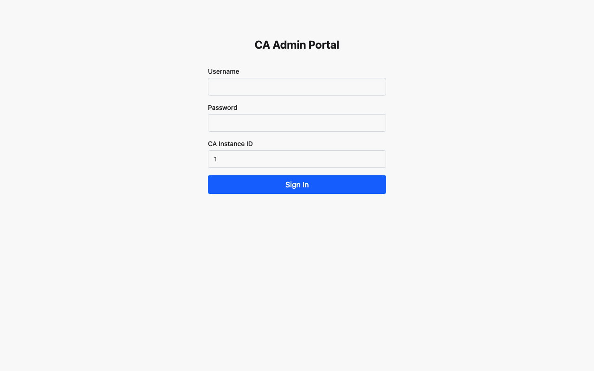

**Steps:**
1. Navigate to `https://your-domain:4002/login`
2. Enter your **Username**
3. Enter your **Password**
4. For multi-instance deployments, verify the **CA Instance ID** (defaults to 1)
5. Click **Sign In**

### 3.3 Dashboard <a name="ca-dashboard"></a>

The dashboard provides an overview of the CA engine status.

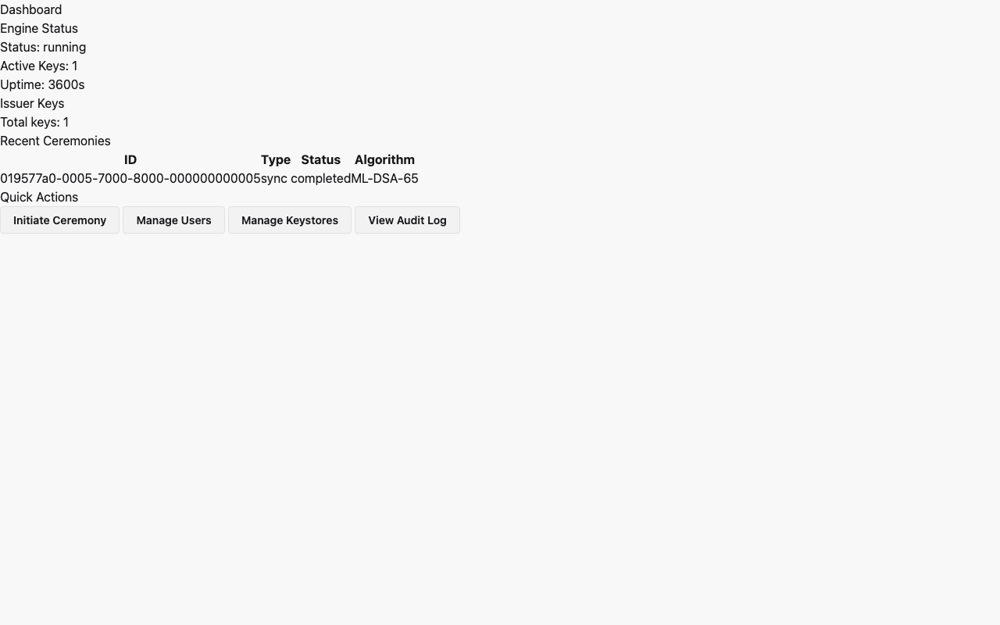

**Information displayed:**
- **Engine Status** — Current state of the CA engine (running/stopped)
- **Active Keys** — Number of issuer keys currently active
- **Uptime** — How long the engine has been running
- **Issuer Keys** — Total number of configured issuer keys
- **Recent Ceremonies** — History of key ceremonies with ID, type, status, and algorithm

**Quick Actions:**
- **Initiate Ceremony** — Start a new key ceremony
- **Manage Users** — Go to user management
- **Manage Keystores** — Configure key storage
- **View Audit Log** — Review system events

### 3.4 User Management <a name="ca-user-management"></a>

Manage users who have access to the CA system.

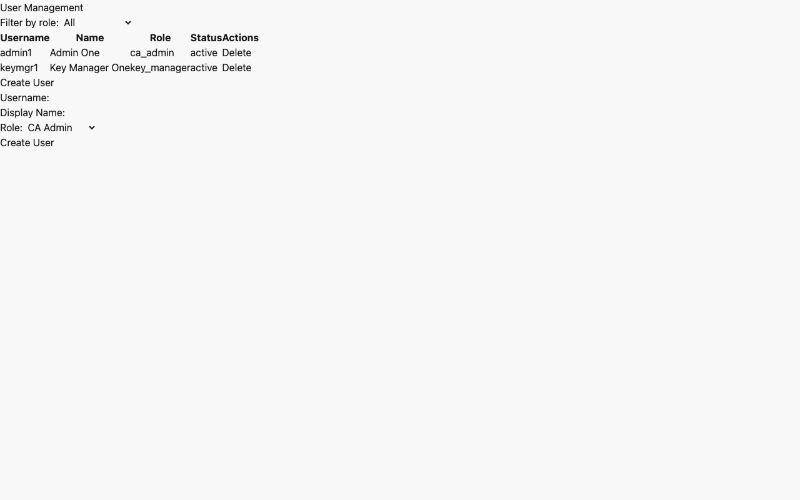

**Viewing Users:**
- The user table shows Username, Display Name, Role, Status, and Actions
- Use the **Filter by role** dropdown to filter by: All, CA Admin, Key Manager, Auditor

**Creating a User:**
1. Enter the **Username**
2. Enter a **Display Name**
3. Select a **Role**:
   - **CA Admin** — Full administrative access
   - **Key Manager** — Manages keystores, keys, and ceremonies
   - **Auditor** — Read-only access to audit logs
4. Click **Create User**

**Deleting a User:**
- Click the **Delete** button on the user's row (soft delete — sets status to "suspended")

### 3.5 Keystore Management <a name="ca-keystore-management"></a>

Configure where private keys are stored.

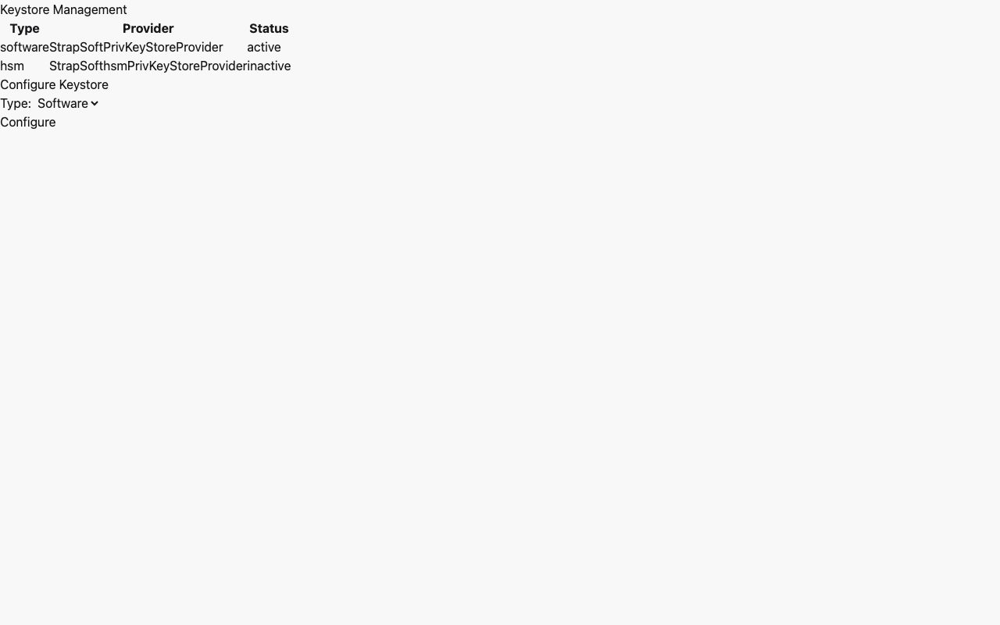

**Keystore Types:**
- **Software** — Keys stored in the application's database (suitable for development and testing)
- **HSM** — Keys stored in a Hardware Security Module via PKCS#11 (recommended for production)

**Configuring a Keystore:**
1. Select the **Type** (software or hsm)
2. Click **Configure**
3. The new keystore appears in the table with its status

### 3.6 Key Ceremony <a name="ca-key-ceremony"></a>

Key ceremonies are the formal process of generating root CA keys with threshold-based secret sharing (Shamir's Secret Sharing).

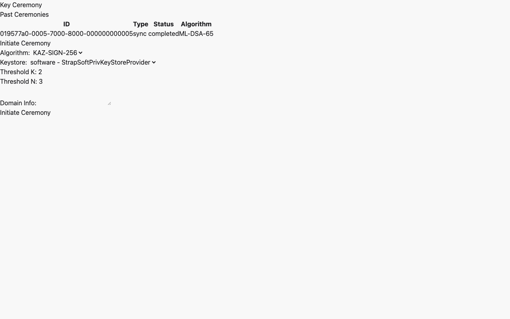

**Past Ceremonies:**
- View history of all ceremonies with ID, Type (sync/async), Status, and Algorithm

**Initiating a New Ceremony:**
1. Select the **Algorithm**:
   - **KAZ-SIGN-256** — Malaysia's PQC algorithm
   - **ML-DSA-65** — NIST PQC standard
   - **RSA-4096** — Classical RSA
   - **ECC-P256** — Elliptic Curve
2. Select the **Keystore** to store the generated key
3. Set **Threshold K** — Minimum number of custodians needed to reconstruct the key (must be >= 2)
4. Set **Threshold N** — Total number of key shares to distribute (must be >= K)
5. Optionally enter **Domain Info** for the certificate subject
6. Click **Initiate Ceremony**

After initiation, the ceremony status will show "initiated". The key manager then proceeds to:
- Generate the keypair
- Distribute encrypted shares to N custodians
- Complete the ceremony (as root CA or sub-CA)

### 3.7 Audit Log <a name="ca-audit-log"></a>

Review all security-relevant events in the system.

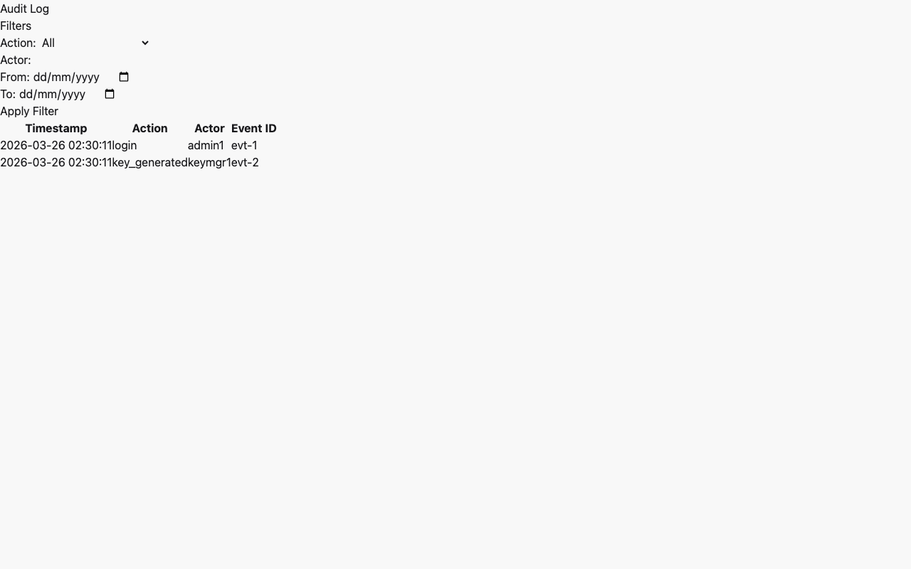

**Filtering Events:**
- **Action** — Filter by event type (e.g., login, key_generated, ceremony_initiated)
- **Actor** — Filter by the user who performed the action
- **Date From / Date To** — Filter by date range

**Event Information:**
- Event ID, Timestamp, Node, Actor, Role, Action, Resource Type, Resource ID

---

## 4. RA Portal — Registration Authority Administration <a name="ra-portal"></a>

The RA Portal is used to manage certificate signing requests (CSRs), certificate profiles, API keys, and service configurations.

### 4.1 First-Time Setup <a name="ra-first-time-setup"></a>

Same as CA Portal — navigate to `/setup` on first deployment to create the initial RA admin.

### 4.2 Login <a name="ra-login"></a>

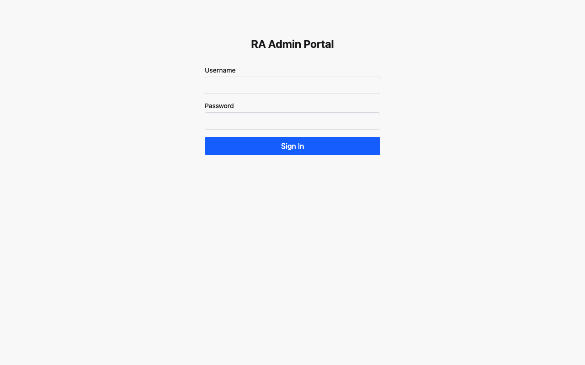

Enter your **Username** and **Password**, then click **Sign In**.

### 4.3 Dashboard <a name="ra-dashboard"></a>

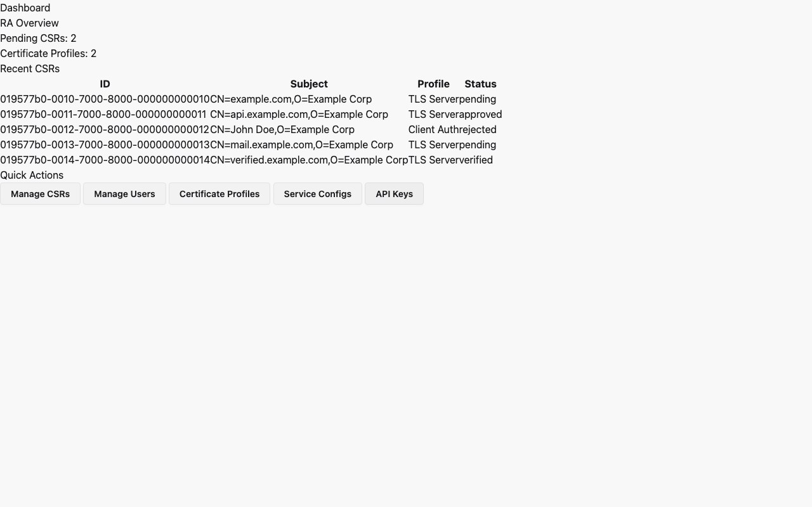

**Information displayed:**
- **RA Overview** — Summary statistics
- **Pending CSRs** — Number of CSRs awaiting review
- **Certificate Profiles** — Number of configured profiles
- **Recent CSRs** — Table showing recent certificate signing requests with Subject, Profile, Status, and Submitted date

**Quick Actions:**
- **Manage CSRs** — Review and process CSRs
- **Manage Users** — User administration
- **Certificate Profiles** — Configure cert profiles
- **Service Configs** — Configure OCSP/CRL services
- **API Keys** — Manage API access keys

### 4.4 User Management <a name="ra-user-management"></a>

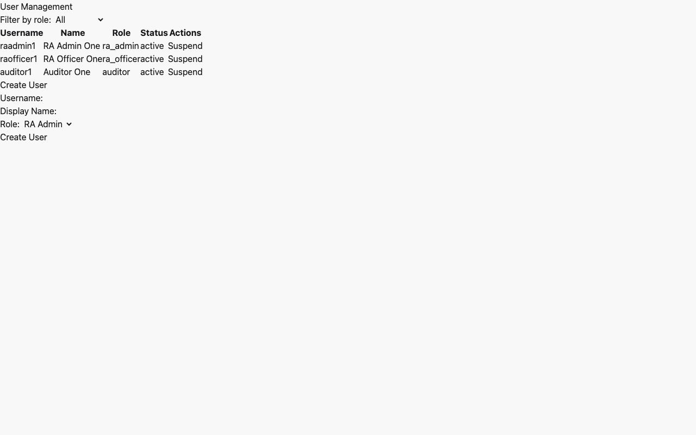

**Roles:**
- **RA Admin** — Full RA administrative access
- **RA Officer** — Reviews and approves/rejects CSRs
- **Auditor** — Read-only access

**Creating and managing users** follows the same pattern as the CA Portal.

### 4.5 CSR Management <a name="ra-csr-management"></a>

Review, approve, or reject Certificate Signing Requests submitted via the REST API.

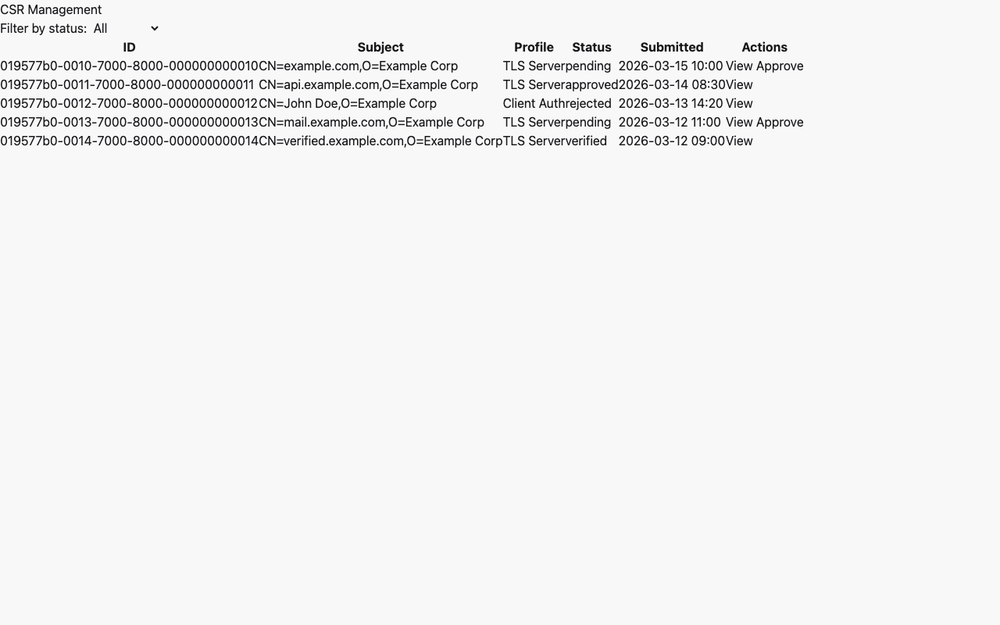

**Filtering CSRs:**
- Use the **Filter by status** dropdown: All, Pending, Approved, Rejected

**Viewing CSR Details:**
1. Click **View** on any CSR row
2. The detail panel shows: Subject, Status, Profile, Public Key Algorithm, Requestor
3. For pending CSRs, action buttons are available

**Approving a CSR:**
- Click **Approve** on a pending CSR row or in the detail panel
- The CSR status changes to "approved" and is forwarded to the CA for signing

**Rejecting a CSR:**
1. Click **View** on a pending CSR
2. Enter a **Rejection Reason** in the text area
3. Click **Reject**

### 4.6 Certificate Profiles <a name="ra-certificate-profiles"></a>

Define templates for certificate issuance with specific key usage and validity policies.

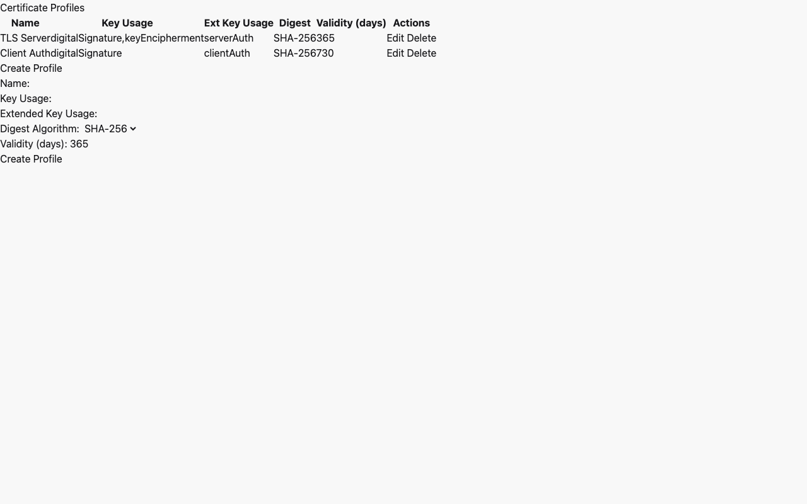

**Creating a Profile:**
1. Enter **Name** (e.g., "TLS Server", "Code Signing")
2. Enter **Key Usage** (e.g., "digitalSignature,keyEncipherment")
3. Enter **Extended Key Usage** (e.g., "serverAuth,clientAuth")
4. Select **Digest Algorithm** (e.g., SHA-256)
5. Enter **Validity (days)** (e.g., 365)
6. Click **Create Profile**

**Editing a Profile:**
- Click **Edit** on the profile row, modify fields, click **Update**

**Deleting a Profile:**
- Click **Delete** on the profile row

### 4.7 Service Configuration <a name="ra-service-configuration"></a>

Configure the OCSP and CRL distribution services.

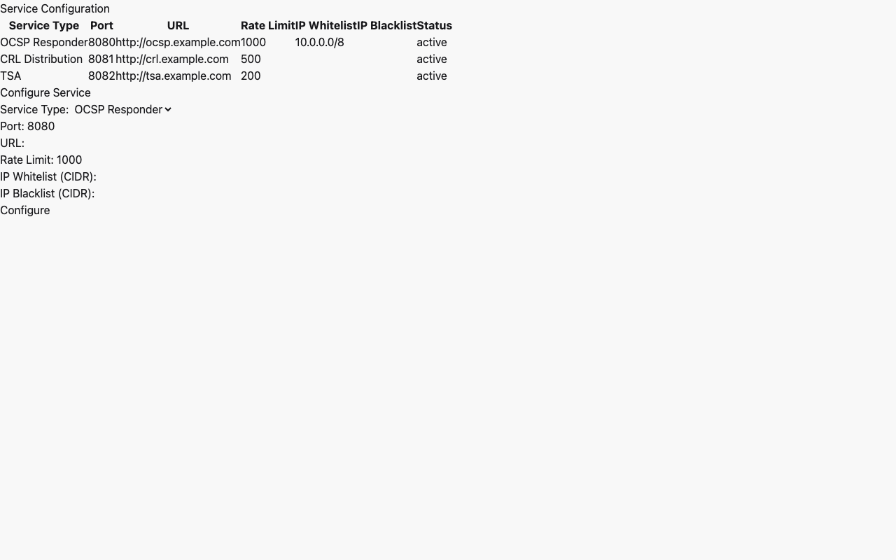

**Configuring a Service:**
1. Select **Service Type**: OCSP Responder, CRL Distribution, or TSA
2. Enter the **Port** number
3. Enter the **URL** (e.g., `http://pki-validation:4005`)
4. Enter **Rate Limit** (requests per minute)
5. Optionally enter **IP Whitelist** (CIDR notation, e.g., `10.0.0.0/8`)
6. Click **Configure**

Reconfiguring the same service type will update (upsert) the existing configuration.

### 4.8 API Key Management <a name="ra-api-key-management"></a>

Manage API keys used by external clients to submit CSRs via the REST API.

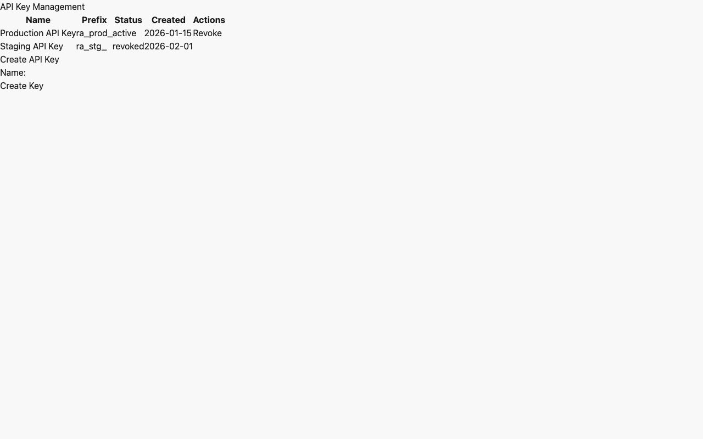

**Creating an API Key:**
1. Enter a **Name** for the key (e.g., "Production Client")
2. Click **Create Key**
3. The **raw API key** is displayed once — **copy it immediately**
4. Click **Dismiss** to close the key display

**Revoking an API Key:**
- Click **Revoke** on the key's row
- The key status changes to "revoked" and can no longer be used

---

## 5. REST API — Submitting CSRs <a name="rest-api"></a>

External systems submit Certificate Signing Requests via the RA Engine REST API.

### Authentication

All API requests require a Bearer token in the `Authorization` header:

```
Authorization: Bearer <your-api-key>
```

API keys are created in the RA Portal (see [API Key Management](#ra-api-key-management)).

### Submit a CSR

```bash
POST https://your-domain:4003/api/v1/csr
Content-Type: application/json
Authorization: Bearer <your-api-key>

{
  "csr_pem": "-----BEGIN CERTIFICATE REQUEST-----\n...\n-----END CERTIFICATE REQUEST-----",
  "cert_profile_id": "<uuid-of-cert-profile>"
}
```

**Response (201 Created):**
```json
{
  "data": {
    "id": "019d2789-f8db-795e-b781-eebfc8fa0b7d",
    "status": "pending",
    "subject_dn": "CN=example.com,O=Example Corp",
    "submitted_at": "2026-03-26T00:27:26Z"
  }
}
```

### List CSRs

```bash
GET https://your-domain:4003/api/v1/csr
Authorization: Bearer <your-api-key>
```

Optional query parameter: `?status=pending|approved|rejected|issued`

### Get CSR by ID

```bash
GET https://your-domain:4003/api/v1/csr/<csr-id>
Authorization: Bearer <your-api-key>
```

### Health Check

```bash
GET https://your-domain:4003/health
```

No authentication required. Returns `{"status": "ok"}`.

---

## 6. OCSP & CRL — Certificate Validation <a name="validation"></a>

### OCSP (Online Certificate Status Protocol)

Query the real-time status of a certificate:

```bash
POST https://your-domain:4005/ocsp
Content-Type: application/json

{
  "serial_number": "<certificate-serial>"
}
```

**Response:**
```json
{
  "status": "good"       // or "revoked" or "unknown"
}
```

If revoked, additional fields are included:
```json
{
  "status": "revoked",
  "reason": "keyCompromise",
  "revoked_at": "2026-06-15T00:00:00Z"
}
```

### CRL (Certificate Revocation List)

Download the current CRL:

```bash
GET https://your-domain:4005/crl
```

**Response:**
```json
{
  "type": "X509CRL",
  "this_update": "2026-03-26T00:00:00Z",
  "next_update": "2026-03-27T00:00:00Z",
  "total_revoked": 0,
  "revoked_certificates": []
}
```

### Health Check

```bash
GET https://your-domain:4005/health
```

Returns `{"status": "ok"}`.

---

## 7. User Roles & Permissions <a name="roles"></a>

### CA Portal Roles

| Role | Permissions |
|------|-------------|
| **CA Admin** | Manage users, view audit logs, manage CA configuration |
| **Key Manager** | Manage keystores, initiate key ceremonies, manage issuer keys |
| **Auditor** | View audit logs (read-only) |

### RA Portal Roles

| Role | Permissions |
|------|-------------|
| **RA Admin** | Manage users, certificate profiles, service configs, API keys |
| **RA Officer** | View, approve, and reject CSRs |
| **Auditor** | View audit logs (read-only) |

### Security Principles

- **Least Privilege** — Each role has only the permissions needed for its function
- **Separation of Duties** — Key ceremony requires multiple custodians (threshold scheme)
- **Audit Trail** — All actions are logged with actor, timestamp, and details
- **Session Security** — Secure cookies with HSTS, same-site strict, HTTP-only flags

---

## 8. Glossary <a name="glossary"></a>

| Term | Definition |
|------|-----------|
| **CA** | Certificate Authority — issues and signs digital certificates |
| **RA** | Registration Authority — validates certificate requests before forwarding to CA |
| **CSR** | Certificate Signing Request — a request to have a certificate signed |
| **PQC** | Post-Quantum Cryptography — algorithms resistant to quantum computer attacks |
| **KAZ-SIGN** | Malaysia's local post-quantum digital signature algorithm |
| **ML-DSA** | Module-Lattice Digital Signature Algorithm (NIST FIPS 204) |
| **HSM** | Hardware Security Module — dedicated hardware for key storage |
| **OCSP** | Online Certificate Status Protocol — real-time certificate validation |
| **CRL** | Certificate Revocation List — list of revoked certificates |
| **Shamir's Secret Sharing** | Threshold scheme where K of N custodians are needed to reconstruct a secret |
| **UUIDv7** | Time-sortable universally unique identifier used for all record IDs |
| **PKCS#11** | Standard API for communicating with HSMs |
